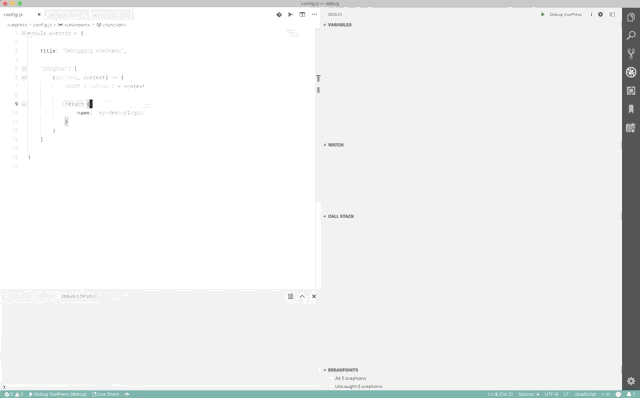
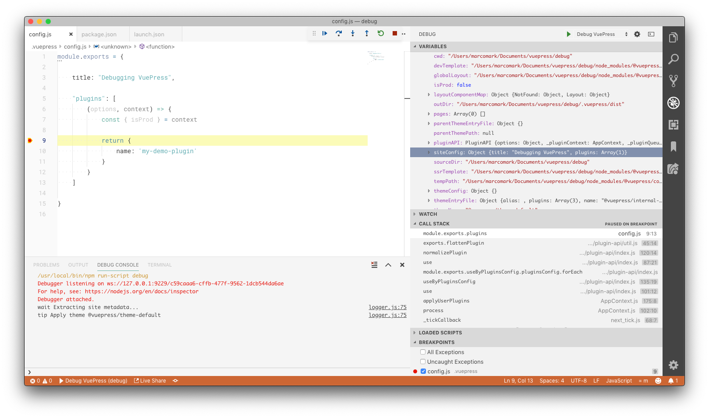

# Debugging VuePress in Visual Studio Code

When developing plugins and themes for VuePress, being able to set breakpoints to step through code and inspect variables in real time is really valuable in order to determine what is hapening during the build process of a VuePress site.

This guide will walk you through a few quick steps to enable the built-in debugger in Visual Studio Code.



## Setup

This guide assumes that you have basic knowledge of VuePress and have a basic site in place with a `.vuepress` folder containing a `config.js` file as documented in the [Official VuePress Documentation](https://vuepress.vuejs.org/guide/basic-config.html)

Add a debug script to your npm package.json file. This will start a debug instance of node and execute the VuePress dev process within the instance. You may need to customise the exact command to suit your directory structure.

```json
...
"scripts": {
    "debug": "node --nolazy --inspect-brk=9229 ./node_modules/.bin/vuepress dev"
}
...
```

Next create a new VS Code launch configuration in `launch.json`

```json
"configurations": [
    {
        "type": "node",
        "request": "launch",
        "name": "Debug VuePress",
        "runtimeExecutable": "npm",
        "runtimeArgs": [
            "run-script",
            "debug"
        ],
        "port": 9229
    }
]
```

You are ready to start debugging. Set a breakpoint and click Start Debugging. You can also check the Debug Console for additional output.



