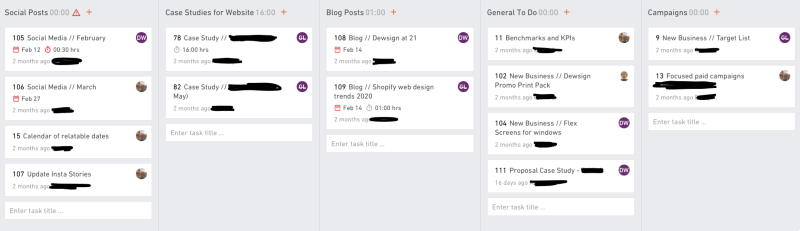
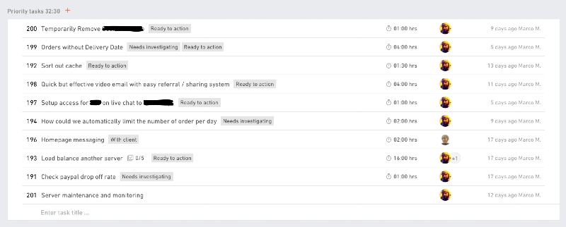

# Using task or project management apps to keep everyone happy and productive

We've all seen it, an endless amount of unmanageable, stale tasks that nobody pays attention to and tasks that never get updated or completed.

I have most certainly seen it, and it isn't pretty!

It most definitely isn't going to make anyone productive. It won't give project managers and managing directors an overview of where things are at and it won't give developers and team members a list of things to work on to self-manage their work. And yet, that is exactly what a project or task management system should be doing. In this article we look at things to do and things to avoid to transform your chaos into structure.

Now, you might have some ideas on how to resolve this problem, so I will start by going through some things to NOT DO, because they are unlikely to solve this issue for you.

## Things to avoid when trying to create a useful task management system

### The software is at fault, let's try another project management application

Maybe! But it probably won't solve your problems. Almost every project and task management platform I have used has the potential to be used well, or not so well; and I have used quite a few like Basecamp, Trello, Teamwork, Workflow Max, Asana, Todoist, Productive, etc.

So my recommendation is to stick with what you have for now and focus on changing or improving your process first. There may well be a good reason to switch to a different platform based on your specific needs later, but it isn't the solution to your problems.

### Every task must be assigned to someone

Again, not saying this won't help, but this alone won't solve your problem. In fact, it might even make things worse because there are potentially more unmanageable tasks assigned to someone, creating more confusion and chaos.

This is typically caused by someone trying to plan a series of events/tasks ahead of time thinking Tom can do A, B and C and Naomi can do D, E and F. When C, D and F are still weeks away from being actionable. If a task isn't ready to actioned, don't assign it to that person. We must try not to confuse task management systems with planning or resourcing software.

Team members should be able to open their task list and work on any task in the system without having to repeatedly scan them all to determine what can actually be worked on.

Ownership and responsibility is very important though! More on that later.

### Every task must have a due date

Definitely don't do this! All too often have I seen this happen and whilst it is important for certain tasks to have a due date because they are required to meet a milestone, typically this is not that useful and you are most likely going to end up with lots of overdue, ignored tasks.

This is usually caused by an unmanaged system where managers or business owners feel frustrated that tasks don't get actioned, so by adding a date to it surely it will be done ... it won't!

Most of the time a task is also not a 5 minute job. It could span multiple days and typically by the time the due date arrives there isn't enough time to actually complete the work. A task management system alone isn't going to fix this, your team resourcing and project planning should ensure people are working on the right projects at the right time. We'll cover more on this in another article.

It's also typically not easy to see what other tasks in the system are due on a given day, so chances are tasks are likely to conflict with each other, making it impossible for someone to action everything, causing frustration for the team.

For now, don't get too hung up on due dates, they are more likely to cause harm than good. Trust!

## Things you need to do to create useful task management

To create a useful task management system is actually relatively straightforward and the basic rule is simple.

**Tasks must be useful, and manageable!**

Here are some rules and guidance to put this simple statement into action.

### Every task must be understandable by someone without any prior knowledge

Possibly the single most important part to avoid a cluttered, unused task or project management system! It sounds stupid, but trust me, without it you are unlikely to ever overcome this problem.

We must remember that a task we create might not be actioned for days or even weeks. So whilst everything is fresh in our mind now, when the person assigned to it opens it up, they might have been on another project for ages or might not even know what you are talking about. This can lead to a number of unwanted situations.

* They shout across the office for you to tell them what this task is all about, distracting everyone and interrupting what you are currently focussed on.
* They ignore the task and move on to something they do understand. Leading to the very problem this article is talking about.
* They assign the task back to you asking for additional info. And when you are already in task overload, this can cause days or weeks of delays. It's also a great excuse for someone not to do something.
* They have to root through emails, slack messages, talk to coworkers, search files and folders to scrape together enough information to action the task. I've been that person – it takes a lot of commitment and dedication which could be spent on actioning the task, and always kills motivation right from the start.

### Be thorough, not lazy

Do the groundwork when creating the task. If files are needed, attach them or provide links to them. Make sure they are converted to the correct format if needed, for example if your team uses Google Drive, don't attach a Word document. Upload it to the drive and convert it ready to be worked with.

**If you are lazy when creating the task, people are much more likely to be lazy when it comes to actioning it. If you put in the effort, people are more likely to put in effort when acting on it.**

It's extremely frustrating for someone to have to perform a step which someone else couldn't be bothered with. It also creates context switching. Janet is meant to be implementing a new software feature, not converting documents or searching for URLs and login details in multiple places. Context switching takes mental energy and causes productivity to fall. Skipping a 5 minute job when creating a task can cause hours of wasted productivity.

### Keep all relevant communication on the task

This is a common issue caused by task chaos. When something isn't updated or responded to, you are more likely to send an email or a slack message asking someone for an update which is likely to resolve in a response which is not visible on the task. Which in turn is likely to cause repeat questions and conversations over time.

This is compounded when a task may be paused or held up for days or weeks. By the time it is ready to be worked on again it will take considerable time and mental energy to work out what state it is in, why it was paused or even know that there is additional communication that took place which needs to be searched for in another system.

For example, if you get an email relating to a task, copy and paste the content into the comments. It takes seconds but can save hours in the long run.

### Actually look at tasks before asking someone

Nobody is going to keep updating information on a task if nobody is going to look at it. It is really frustrating to be asked about the status of something when you have spent quality time documenting your progress on a task. You'll simply stop documenting it if you keep getting asked about it anyway.

Creating, managing and completing tasks becomes a chore when nobody else pays any attention. When everyone in the team is looking at relevant tasks, communicating on them and acknowledging their completion or progress, it becomes rewarding and is much more likely to form into a positive habit for everyone.

### Every task must have a single owner with sole responsibility

Not the same as the don't do, "Every task must be assigned to someone", we talked about earlier. What we have to avoid is a "Tom and Ben, could someone sort this out". Because chances are neither Tom or Ben are going to sort it out. Ask one person to deal with something and let them delegate if needed.

### Each task should be for a single issue/outcome

When a task is created for multiple issues it can be very difficult to keep track of comments and determine which parts are done or not done. It also makes it harder to focus on a single task and see it through when something else might be holding up part of the other task.

### Every task name should be easily identifiable

This one can be difficult, especially when terminology can vary between client and internal teams. However it is really important to make it easy to identify a task to avoid duplication. Ideally you have one person in charge of looking after your task management platform which should help in identifying duplicates and maintain a consistent language across tasks, as described in the last point on this article.

### Closed tasks should have a clear resolution

Always make sure there is a comment describing the outcome of the task. We can't just assume that because it has been marked as closed, done or completed, that the work has actually been carried out. When a client asks about this work in 6 weeks time and you look at this completed task you are likely to be confused and you won't be able to deal with the enquiry straight away, causing more work, delays and unhappy clients.

Adding thorough, meaningful and positive status updates and comments to the task when you work on it will encourage everyone else to do the same and create a really satisfying experience day-to-day.

### Avoid Kanban

Yes, I said it. Kanban seems like a great concept in theory, but reality is rarely that simple. So unless you actually work in **real sprints**, stick with a more traditional list or table layout.

A board style layout like this makes it very difficult to actually find a relevant task or to know what state a task is in. There are also a lot of micro-decisions to make, like which column should the new task go into. Where does a social post relating to a blog belonging to a campaign go? Into social posts, blog articles or campaigns? Using this board requires a lot of knowledge and is open to subjective decisions which are asking for trouble.

For sure, there are situations where Kanban is good, but if you are reading this and suffer from task chaos my recommendation is to avoid "To do", "Doing", "Done" type structures.

### Use tags where possible

Following on from the "Avoid Kanban" point, using a list view with tags is really easy for the human brain to scan and see where things are at. Rather than having to scan multiple columns and associating each column with a given state.

This list view example makes it really easy to scan and find a task and immediately see what state it is in. Adding a task is simple and there are no micro-decisions to be made and there is no requirement for subjective choices.

If you can create global tags in your system this will be helpful with maintaining consistent terminology, but tags will be useful regardless.

Here are some tag examples for inspiration

* Ready to action
* Internal QA
* Client QA
* Ready to deploy
* Gone live
* Needs client comms
* Awaiting information

### Check every task created and closed – every day

Again, sole responsibility is important. One person should own this. As soon as tasks which don't follow the process slip through the cracks, things will get out of hand quickly and you are back to where you started.

If someone has created a task without any details and assigned it to a team member, re-assign it back to the creator and ask them to provide additional information.

If someone closed a task without resolution, re-open it and ask them to add a closing remark. This can simply be "this has been completed" or "this was not actioned because the client changed their mind". Ideally though it should be a thorough statement about what happened which someone completely new to the project could understand and be finished with positive feedback as mentioned earlier.

## Summary

* Choose whatever task/project management app appeals to you or stick with what you have.
* Only assign tasks to someone when they have all the details and are clearly defined and ready to be actioned.
* Avoid relying on due dates on tasks.
* Tasks must be useful, and manageable!
* Anyone without prior knowledge should be able to understand what each task is about.
* Be thorough. Add links, files and communication.
* Actually use the system and look at task before asking someone.
* Each task should focus on a single issue.
* Use consistent terminology and detailed task names to make them identifiable.
* Always add a clear resolution or outcome before closing a task.
* Avoid Kanban layouts, prefer list or table views and use tags.
* Keep a tidy house. Unless you check every day, things will get messy. You can't simply rely on others to stick to the rules.

Here are some checklists which I daily to help me remember to keep things tidy.

* [Project management and resourcing routines for software and web teams](https://listshare.app/m2de/list/S0u2GAm4vI)
* [How to efficiently deal with challenging tasks, feel good about work and make everyone happy.](https://listshare.app/m2de/list/GgFIDrWXCF)
* [6 steps to cover on every feature or change request](https://listshare.app/m2de/list/c6aOhTqgvS)
* [10 steps to a better development workflow](https://listshare.app/m2de/list/FQokSdQNMN)
