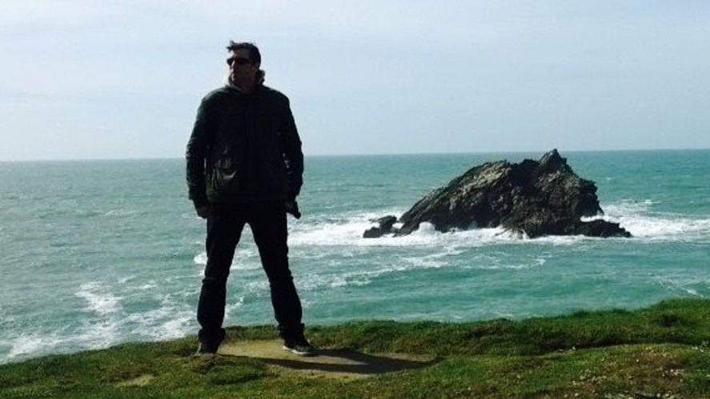

# Me, myself and I

Born in Germany, and having moved to Cornwall in 1997, I speak fluent German and English, although I prefer to speak English these days and only have a slight accent. I have worked with clients in the UK, Germany and the United States.

Over the past 20+ years I have created countless websites, software and mobile applications and have worked with many reputable companies including Tiscali (now Talk Talk), Royal Cornwall Show, British Home Stores and Cornwall Council.

## Current Focus

Much of my spare time goes into developing my skills and knowledge in the Strategy, User-Experience (UX) and Technology, which goes hand-in-hand with my current role as Technical Lead and Senior developer at *[Dewsign](https://www.dewsign.co.uk)*.

Having worked with so many businesses over the years, as well having run my own successful ecommerce business generating almost one million pounds turnover, I have real-world knowledge and experience of developing, marketing and day-to-day running of digitally foccused businesses.

Both user-centric design and business logic are really important to me and I have more recently run very successful UX and strategy workshops for SME and largeer companies such as *The Ritz Club London*.

Having hands-on knowledge of multiple language, platforms and ecommerce gives me invaluable experience which can be applied to projects I manage.

## Personal Interests

I love living in Cornwall; currently near Helston. My personal interests include Volleyball, Motorsports, Gadgets and Technology. Volleyball used to take up a lot of my time, playing for Kernow in the National Volleyball League involves its fair share of weekend travelling to Wales, Bristol and even Essex. To help increase the sports popularity in cornwall I run and manage both the Cornwall Volleyball Association website and the Truro Volleyball Club.
