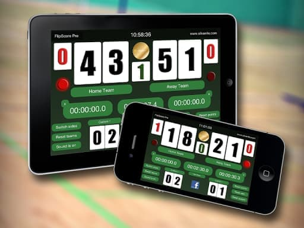
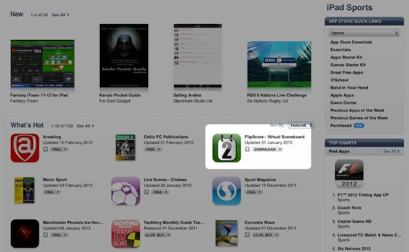

# Flipscore iOS and Android Mobile App

Designed as an all purpose Scoreboard, FlipScore Pro came with a lot of useful features suitable for every activity. No matter what you wanted to keep track of, FlipScore Pro was a reliable companion for sports, board games, cards and much more.

## Pro version features included

* Voice Announcement – New Text-to-speech voice announcement of the current score (*Internet connection required)  
* Facebook Share – Upload screenshots of your greatest victories and share them with your friends on Facebook  
* Coin Toss – For quick decision making  
* Side Markers – Highlight the relevant team/player to track service, possession, turns etc.  
* Timer – Freely adjustable countdown timer with buzzer sound  
* Period Digit – To keep track of periods, quarters, current set etc.  
* Custom Lower Digits – Freely configurable digits for everything else you want to keep track of like time outs and fouls or even for 3-4 Player games.  
* Future Updates – Customer feedback means a lot to us. You want it? We’ll add it!

## Statistics

Apple featured the app in an "Apps for Coaches" promotion which saw a huge rise in Downloads and helped push the app into some of the Sports related categories include the top 50 iPad sports apps in the USA.

* Over 100,000 downloads
* Ranked in the top 50 iPad Sports Apps
* Ranked top 100 Amazon Sports Apps
* Maintained for over three years

The first version of the app was actually created in Java, natively for Android OS. I later wrote a completely new version in LUA using the Corona Labs SDK, allowing me to build the mobile app for both iOS and Android using the same codebase. The free version featured mobile Ads from my own ad management platform, essentially just cross-promoting all my apps and the paid version removed ads and offered a number of additional features.
