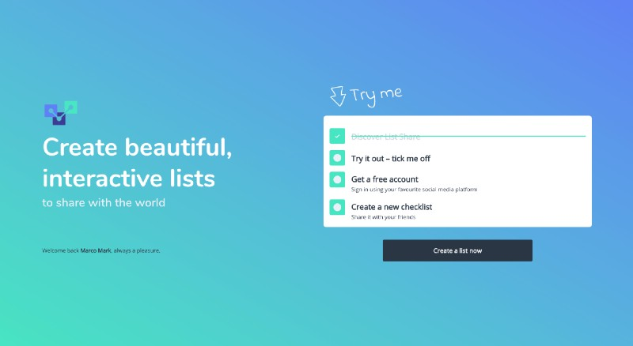

# listshare.app Vue.js / Laravel Application

## The problem

For years I have been looking for a good way to create checklists for common or regularly performed tasks at work. Like everytime we launch a new site, there is a whole list of things that need to be checked and remembered. We tried using Trello, but it gets so messy and lists are duplicated all over the place and everything else I tried all assumes that your lists are "one-off" checklists. I simply wanted a place where I can have a list that I open everytime I do a specific task, so I can sanity check my work.

## The opportunity

As it happens, I have also been looking for an idea to build an SPA or Saas product around, so this seemed like a great opportunity. Keep functionality to the absolute minimum and build a high quality, polished application.

## The stack

I debated for some time on this. In a perfect world I would have used this opportunity to finally dive into some React and a Node.js backend; but we don't live in a perfect world. So instead I opten for what I know best and created a Laravel backend with Vue.js SPA front-end. Well, I actually ended up with multiple server rendered routes to improve SEO, instead of trying to go full-blown SSR. So when you access a list directly, the data is actually passed straight into the Vue component, but once loaded, everything after that happens via Ajax.

## The result

Great! I would say that, but honestly, it turned out exactly how I wanted it and I literally use this application myself every single day at work, and many of my co-workers also started using it. Creating their own and referring to my checklists.

My plan is to start blogging about the journey, because there have been so many learnings and decisions to make, which I imagine would be quite insightful to others looking to create their own web app.
