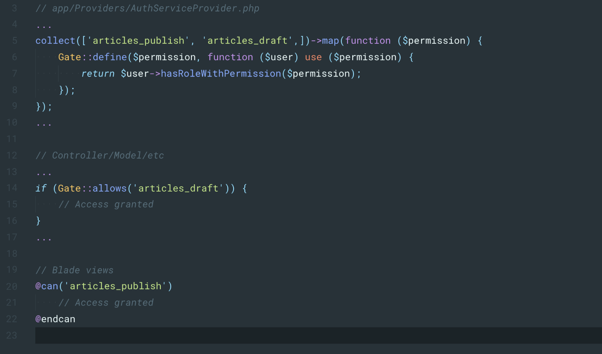
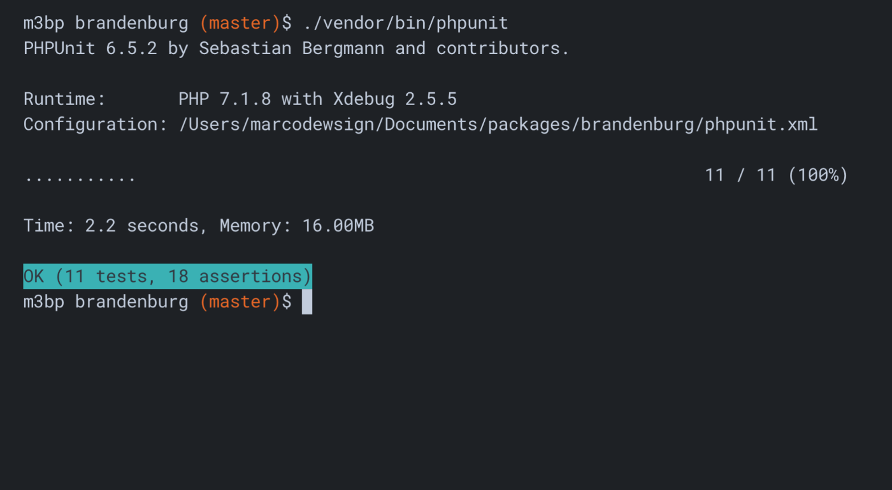
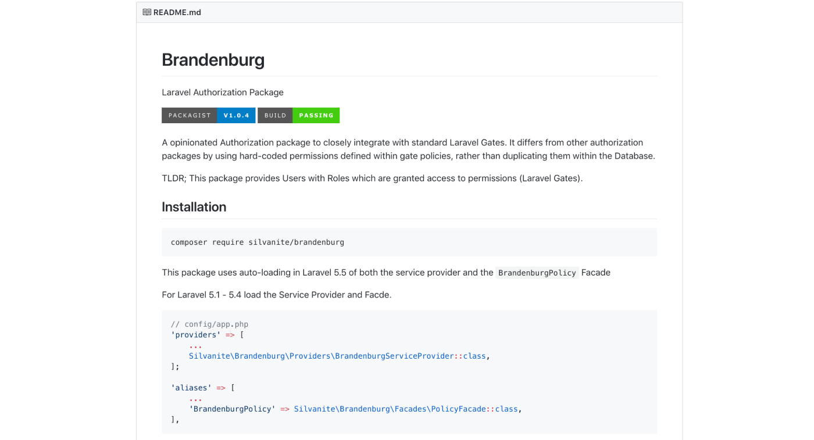

# Brandenburg – Laravel Authorization Package

In almost every Laravel project I have started I needed to implement some kind of Permissions based Authorisation and I have never found a simple package to pull in without requiring me to follow complex instructions or non-standard ways to authorising users.

I wanted a super-simple package which took care of the basics, allowing me to use Laravel's official, documented methods for validating permissions. So I created a package to do exactly that. Days after sharing it with some of the Laravel community through Laravel News the package had over 25 stars and almost 100 installs.

## Tests

The first thing I really wanted to implement was a reasonable test suite to ensure that any changes I make in the future wouldn't impact existing users. This was slightly more involved than writing basic php unit tests because the package is designed to work with Laravel and assumes that it is implemented into a Laravel installation.

I ended up using Orchestra Testbench, a Laravel testing framework which is relatively easy to setup with some initial configuration. This will essentially spawn a Laravel instance to run your tests in. Using this I was able to require my package into a clean Laravel installation and test all of its core features.

Now, simply running `phpunit` will take of the rest.

## Continuous Integration (CI)

Having taken car of the tests, the next step was to ensure that no code could be published which doesn't pass the tests. I setup and configured TravisCI to automatically run tests when new code is pushed into the repository, allowing me to check that Pull Requests pass tests before merging them into the master branch and tagging a new release.

For good measure, and to reassure users that can use my package without worrying about it breaking their product, I added a Badge to the repository showing the current test status of the master branch, hopefully through a nice green **Passing** status.

## Documentation

Last but not least, Documentation is so important when releasing any open-source software. The main reason for creating this package was to provide a super easy, quick way of adding authorisation to a Laravel project, so I tried to reflect this in the documentation by keeping it really simple and to the point. It covers installation and typical usage and assuringly, a couple of different members of my team at work have successfully implemented Brandenburg into projects using this documentation.

## More information

You can follow Brandenburg progress or contribute on [Github](https://github.com/Silvanite/brandenburg).

To use Brandenburg, simply visit the [Packagist](https://packagist.org/packages/silvanite/brandenburg) page and follow the instructions.

I have also written a blog post outlining the reason for creating this package and the approach taken. You can read it over at [Codeburst on Medium](https://codeburst.io/simpler-better-laravel-authorization-using-brandenburg-6ef9a24ef846).