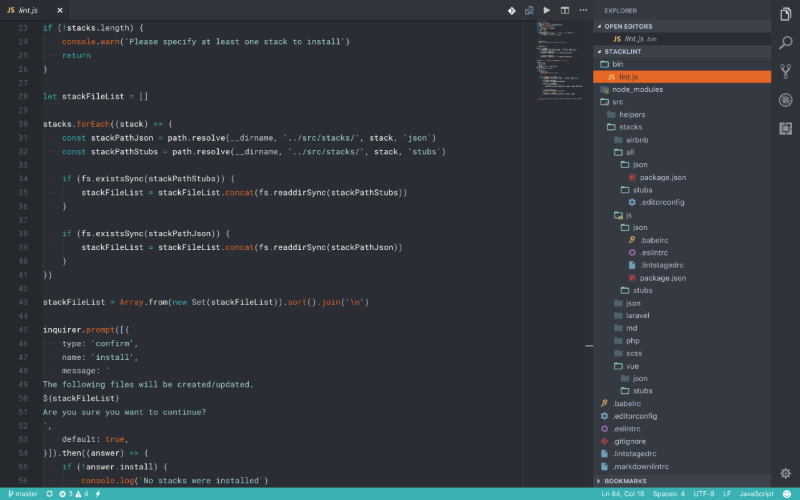

# Stacklint – Code linting and styling CLI tool

## tl;dr

Stacklint is a CLI tool available through npm to quickly install linting presets for various code-stacks.

Linting is used to improve code-consistancey across projects and developers, and helps to ensure that everyone on the project can both understand the code, as well write code in the same style and structure. This greatly improves efficiency and maintinability of projects.

It has always been quite challenging to find an easy, quick way to scaffold new projects with the same linting standards without resorting to a boilerplate repository to fork new projects from which resulted in another project to maintain.

Stacklint is a simply Node command line interface (CLI) tool to make this process much easier whilst playing nicely with other CLI tools which are already in place to sclaffold boilerplate applications like Laravel's `laravel new project` or vue-cli. After settings up a new project we can simply run `stacklint laravel md json` and all linting presets are automatically installed and ready to go.

The code uses stubs for any generic configuration files like a `.editorconfig` which are simply created if they don't exist and stack specific configs which are merged into existing Composer or Node/NPM configurations. This makes is really easy to add new language or styleguide configs. When installing these you can specify which linters and styles you want to use on the project. For example on a Vue project we would run `stacklint js vue airbnb` to install everything required to lint Javascript and Vue files with the Airbnb styleguide.

Node makes it super easy to create globally installed command line tools which you can run from any location in your terminal. And because we are just working with node we can write modern ES6/ES2015 Javascript without having to worry about transpiling code for browser compatibility. The open-source tool is published via NPM so it can be installed really easily by simply running `npm install -g stacklint`.

## More information

You can follow Stacklint progress or contribute on [Github](https://github.com/thesold/stacklint). I'm always looking for contributors to add additional stacks.

To use Stacklint, simply visit the [NPM](https://www.npmjs.com/package/stacklint) page and follow the instructions.
